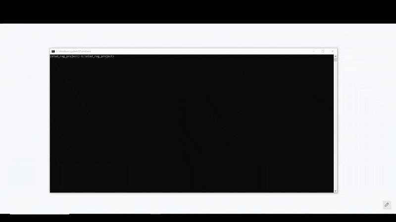

# RAG Chatbot with LangGraph + Gemini

## 1. Project Overview

This project implements a sophisticated **Retrieval-Augmented Generation (RAG)** assistant for AWS Cload Security using **LangGraph** and **Google Gemini**. It enables semantic search, context-aware Q&A, and explainability within answers questions within a defined domain of AWS Cload Security by retrieving relevant passages from a local knowledge base and generating responses grounded in those passages.

**Key Features:**

*   **Conversational Query Rewriting:** Improves answer quality by  rewriting questions into form more optimal for sementic RAG.
*   **Follow-Up Question Understanding:** Understands follow-up questions (e.g., "elaborate on number 2") by rewriting them into standalone queries using chat history.
*   **Document Ingestion:** Preprocesses and chunks local files (PDF/HTML/MD) via semantic chunking.
*   **Hybrid Retrieval:** Uses dense vector search (Chroma) and optional keyword search (BM25) to find candidate documents.
*   **LLM Reranking:** A Gemini-powered node evaluates and selects the most relevant passages before generation.
*   **Grounded Generation with In-line Citations:** Gemini generates answers strictly from the provided context and cites sources directly in the text (e.g., `...using MFA [1][3].`).
*   **Streaming Streamlit UI:** An interactive chat interface that streams responses and displays parsed, verified sources.

> Only **`GOOGLE_API_KEY`** is required as an environment variable. All other settings are managed in `settings.py` and can be overridden by environment variables.

### Demonstration

Here is a brief demonstration of the chatbot in action, showing a conversational follow-up and in-line source citation.


---

## 2. Architecture

### Architecture Diagram

The diagram below illustrates the flow of data through the LangGraph application, from the initial user question to the final, grounded answer.


### High-Level Flow

```
User Question + Chat History
   ↓
LangGraph Workflow:
  1) Rewrite:   Gemini rewrites the question into a standalone query.
  2) Retrieve:  Chroma vector search (+ optional BM25 keyword candidates).
  3) Rerank:    Gemini scores passages and selects the best subset.
  4. Generate:  Gemini answers strictly from the reranked context with in-line citations.
   ↓
Streamlit UI streams the answer and parses citations to show verified sources.
```

### Components

1.  **Data Ingestion (`ingest.py`)**

    *   Loads files from `data/` (PDF/HTML/MD).
    *   Cleans and normalizes text (removes artifacts, collapses whitespace).
    *   Prepends a header (`<Title — Page N>`) to each page to improve retrieval and citations.
    *   Splits into overlapping chunks (defaults to **600** chars, **120** overlap).
    *   Creates embeddings with **`models/text-embedding-004`**.
    *   Persists to **Chroma** (default collection: **`knowledge_base`**) under `storage/`.
    *   Builds an **optional BM25** keyword index at `storage/bm25.pkl`.

2.  **LangGraph Pipeline (`graph.py`)**
    *   **`rewrite`**: Uses `chat_history` to transform conversational questions into clear, standalone search queries.
    *   **`retrieve`**: `Chroma.as_retriever(search_type="mmr", ...)` for diverse vector hits; merges with BM25 results.
    *   **`rerank`**: Gemini evaluates the candidate list and returns the top N indices.
    *   **`generate`**: Gemini answers using a domain-aware prompt, strictly following instructions to add in-line citations `[1]`, `[2]`, etc., after each claim.
    *   **Graph edges**: `rewrite → retrieve → rerank → generate`.

3.  **User Interface (`app_streamlit.py`)**

    *   Simple Streamlit chat app with response streaming.
    *   Maintains chat history in session state for conversational context.
    *   After receiving an answer, it parses the in-line citations (e.g., `[1]`, `[3]`) and displays only the corresponding, verified sources in an expander.

---

## 3. Technologies Used

| Technology                       | Purpose                          | Reason for Choice                                        |
| -------------------------------- | -------------------------------- | -------------------------------------------------------- |
| **LangGraph**                    | Orchestrates multi-step workflow | Clear state management, easy to debug and extend         |
| **Google Gemini**                | LLM for generation & reranking   | Strong reasoning, reliable JSON, and instruction-following |
| **GoogleGenerativeAIEmbeddings** | Dense embeddings                 | High-quality, same vendor as LLM                         |
| **Chroma**                       | Vector DB                        | Lightweight, local, persistent                           |
| **BM25**                         | Keyword retrieval                | Boosts recall for acronyms/phrases                       |
| **PyMuPDF/Unstructured/PyPDF/BS**| Parsing documents                | Robust multi-format extraction                           |
| **Streamlit**                    | UI                               | Fast to build and run locally                            |
| **Settings Management**          | Centralized configuration        | `settings.py` provides typed, env-aware defaults         |

---

## 4. Installation and Running

### Prerequisites

*   Python **3.10+**
*   A Google Generative AI API key.

### Steps

1.  **Clone & enter project**

    ```bash
    git clone https://github.com/mrlifelesss/elad_rag_project
    cd <your-project-folder>
    ```

2.  **(Optional) Create venv**

    ```bash
    python -m venv .venv
    # Windows: .venv\Scripts\activate
    # macOS/Linux: source .venv/bin/activate
    ```

3.  **Install dependencies**

    ```bash
    pip install -r requirements.txt
    ```

4.  **Set your API key**

    Create a `.env` file in the project root:
    ```
    GOOGLE_API_KEY=your_google_api_key_here
    ```
    The application will load it automatically.

5.  **Add documents**
    Place relevant PDF, HTML, MD, or TXT files into the `data/` directory.

6.  **Ingest documents**

    ```bash
    python ingest.py
    ```
    This creates a persistent Chroma DB in `storage/` and (optionally) `storage/bm25.pkl`.

7.  **Run the UI**

    ```bash
    streamlit run app_streamlit.py
    ```

---

## 5. Usage

*   Ask questions in the Streamlit chat about your document domain (e.g., AWS IAM, CAF Security Perspective).
*   For follow-up questions, you can be conversational (e.g., "tell me more about the second point"). The system will rewrite your query using the chat history.
*   The system generates a grounded answer with citations embedded directly in the text, like `...requires MFA [1].`
*   Below the answer, an expandable **"Sources"** section will show the full text of only the documents that were explicitly cited.

---

## 6. Example Queries

*   *“List the five core capability domains of the AWS CAF Security Perspective.”*
*   *“What are three recommendations to protect the AWS root user?”* (Then follow up with: *"can you elaborate on the third one?"*)
*   *“Explain least privilege in IAM and give two concrete implementation methods.”*

---

## 7. Configuration

All settings are managed in `settings.py` and can be overridden with environment variables.

**Key settings in `settings.py`:**

*   `GEMINI_MODEL`: Defaults to `gemini-2.5-flash`.
*   `EMBED_MODEL`: Defaults to `models/text-embedding-004`.
*   `CHUNK_SIZE`, `CHUNK_OVERLAP`: Document ingestion parameters.
*   `RETRIEVE_K`, `FETCH_K`, `MMR_LAMBDA`: Retrieval tuning parameters.

---

## 8. Troubleshooting

*   **Irrelevant answers or out-of-scope errors**:
    *   Ensure you placed files into `data/` and ran `python ingest.py`.
    *   Verify `storage/` contains Chroma files.
    *   Confirm `COLLECTION_NAME` in `settings.py` matches what was used during ingestion.
*   **Slow answers**:
    *   The `rerank` node adds latency. You can experiment with making the graph simpler (`rewrite → retrieve → generate`) for speed at the cost of some relevance.

---

## 9. Future Improvements

*   **More Robust Evaluation:** Create a script to run questions from `eval_questions.json` and score the generated answers for factual consistency and citation accuracy.   
*   **Support for remote vector stores** (e.g., Pinecone/Weaviate) for larger-scale applications.
*   **Document Type Filtering** for better retrival accuracy.
*   **LLM-as-Judge Verification:** As an alternative to in-line parsing, one could implement a "judge" LLM that verifies each source against the final answer, which is slower but can be more robust if the primary LLM fails to cite correctly.
*   **Ingestion UI** Allow to adding documents to the knowledge base directly from the UI.
